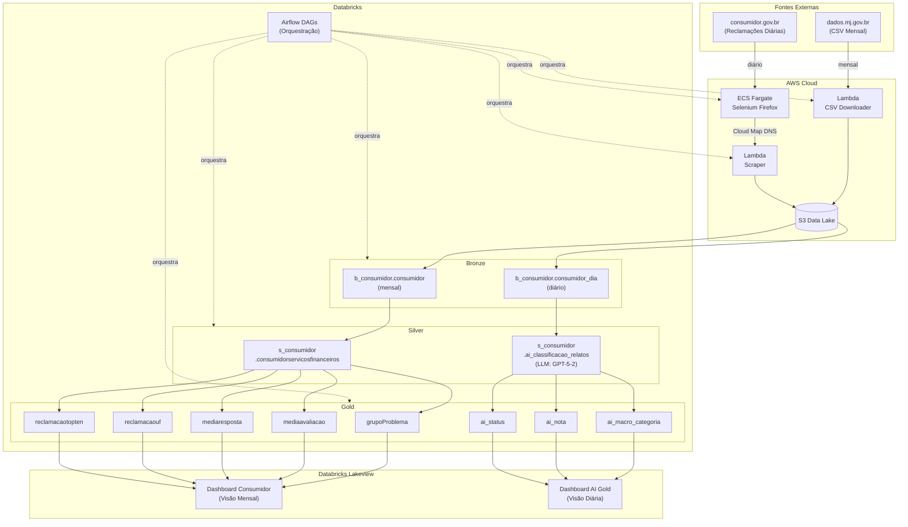
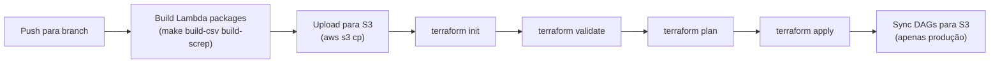
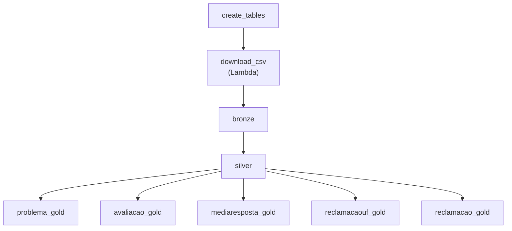
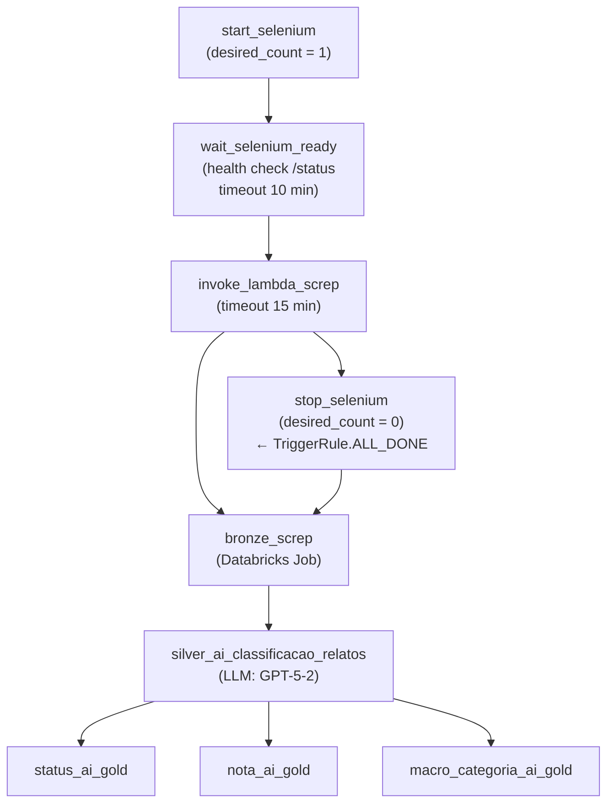

# Arquitetura e Documentação Técnica — data-master-cloud

## Contexto do Projeto

O **data-master-cloud** é a evolução cloud-native do projeto [data-master](https://github.com/lucassan202/data-master), que analisava reclamações de consumidores publicadas no portal [consumidor.gov.br](https://www.consumidor.gov.br) utilizando um cluster Hadoop/Spark on-premise.

O objetivo da migração foi eliminar a necessidade de infraestrutura física gerenciada manualmente, substituindo-a por serviços gerenciados da AWS e Databricks. Com isso, o projeto ganhou:

- **Escalabilidade automática** — sem provisionamento manual de servidores
- **Infraestrutura como Código** — toda a nuvem definida em Terraform
- **CI/CD integrado** — deploy automatizado via GitHub Actions
- **Custo sob demanda** — recursos pagos apenas quando utilizados

O projeto opera dois pipelines complementares de ingestão: um **mensal**, que baixa o CSV consolidado de reclamações do portal `dados.mj.gov.br`, e um **diário**, que faz web scraping incremental das reclamações publicadas em `consumidor.gov.br`. Os dados são processados em camadas de qualidade progressiva (Medallion Architecture), enriquecidos com **classificação automática via LLM** (macro-categoria, categoria, subcategoria, roteamento, prioridade e geração de respostas) e disponibilizados em dois dashboards analíticos Databricks Lakeview.

---

## Arquitetura de Alto Nível



---

## Componentes de Infraestrutura

### AWS Lambda

Duas funções Lambda são responsáveis pela ingestão de dados:

| Função | Descrição | Runtime | Memória | Timeout | Arquivo |
|--------|-----------|---------|---------|---------|--------|
| `download-csv-consumer` | Baixa o CSV mensal de reclamações de `dados.mj.gov.br` e salva no S3 | Python 3.11 | 512 MB | 5 min | [app/src/lambda/lambda_download_csv.py](../app/src/lambda/lambda_download_csv.py) |
| `screp` | Scraper Selenium que extrai o texto completo das reclamações via navegador headless. Conecta ao ECS Selenium via Cloud Map DNS (`SELENIUM_URL`). Roda em VPC (subnets privadas) com Selenium Layer. | Python 3.11 | 512–1024 MB | 15 min | [app/src/lambda/screp_reclamacoes.py](../app/src/lambda/screp_reclamacoes.py) |

As Lambdas são empacotadas via `Makefile` (`make build-csv`, `make build-screp`) e armazenadas no S3 antes do deploy pelo Terraform. Logs são enviados ao CloudWatch com retenção de 14 dias.

---

### ECS Fargate — Selenium Standalone

O scraper Selenium exige um navegador real. Para isso, um container **Selenium Standalone Firefox** roda no ECS Fargate:

- **Imagem:** configurável via variável Terraform (`var.docker_image_name`)
- **Comunicação:** a Lambda conecta via DNS interno `selenium.<namespace>.local:4444` (AWS Cloud Map + Service Discovery)
- **Health check:** `curl http://localhost:4444/status` (intervalo 30 s, timeout 10 min no startup)
- **Monitoramento:** Container Insights habilitado no cluster ECS
- **Logs:** CloudWatch Logs com retenção de 7 dias
- **Recursos:** CPU e memória configuráveis via variáveis Terraform (`var.cpu`, `var.memory`)
- **Variáveis de ambiente:** carregadas de arquivo no S3 (`_vars.env`)

O ECS é orquestrado pelo Airflow — o `desired_count` do serviço é controlado dinamicamente (0 quando ocioso, 1 durante execução) e ignorado pelo Terraform (`lifecycle.ignore_changes`). O container é ligado sob demanda pelo DAG diário e desligado após a conclusão, independente do resultado, evitando custos desnecessários.

---

### Databricks

Substitui o cluster Hadoop/Spark on-premise. Responsável por todo o processamento das camadas de dados:

- **16 Notebooks** gerenciados por Terraform ([IaC/notebooks.tf](../IaC/notebooks.tf))
- **13 Jobs** automatizados com notificação por e-mail ([IaC/jobs.tf](../IaC/jobs.tf))
- **2 Dashboards Lakeview** gerenciados por Terraform ([IaC/dashboards.tf](../IaC/dashboards.tf))
- **Serverless SQL Warehouse** para execução dos notebooks
- **Classificação via LLM** — utiliza `ai_query()` com modelo GPT-5-2 (parametrizável)
- Autenticação via Service Principal (OAuth M2M)

---

### Databricks Lakeview Dashboards

A visualização dos dados é feita por **dois Dashboards Lakeview** nativos do Databricks, implantados automaticamente via Terraform.

#### Dashboard Consumidor (Visão Mensal)

**Arquivo:** [dash/dash_consumidor.lvdash.json](../dash/dash_consumidor.lvdash.json)

Consome as tabelas Gold do pipeline mensal e apresenta os seguintes componentes:

**Datasets (queries SQL):**

| Dataset | Tabela Gold | Descrição |
|---------|-------------|----------|
| `ds_reclamacao` | `g_consumidor.reclamacaotopten` | Top 10 reclamações por instituição |
| `ds_mediaresposta` | `g_consumidor.mediaresposta` | Tempo médio de resposta por instituição |
| `ds_mediaavaliacao` | `g_consumidor.mediaavaliacao` | Média de avaliação por instituição |
| `ds_reclamacaouf` | `g_consumidor.reclamacaouf` | Volume de reclamações por UF |

**Visualizações:**

| Tipo | Título | Descrição |
|------|--------|----------|
| KPI (counter) | Total Reclamações | Soma total de reclamações |
| KPI (counter) | Média Tempo Resposta (dias) | Média geral do tempo de resposta |
| KPI (counter) | Média Avaliação | Nota média dos consumidores |
| Gráfico de barras | Total Reclamações por Instituição | Ranking horizontal por volume |
| Gráfico de barras | Quantidade Reclamações por UF | Distribuição geográfica |
| Gráfico de linhas | Quantidade de reclamações por mês | Evolução temporal |

**Filtros globais:** Instituição Financeira e Ano-Mês, aplicados a todos os widgets simultaneamente.

#### Dashboard AI Gold (Visão Diária)

**Arquivo:** [dash/dash_ai_gold.lvdash.json](../dash/dash_ai_gold.lvdash.json)

Consome as tabelas Gold do pipeline diário de classificação AI. Página: **"Análise IA Gold - Visão Diária"**.

**Datasets (queries SQL):**

| Dataset | Tabela Gold | Descrição |
|---------|-------------|----------|
| `ds_macro_categoria` | `g_consumidor.ai_macro_categoria` | Contagem de reclamações por macro-categoria (12 categorias) |
| `ds_nota` | `g_consumidor.ai_nota` | Distribuição de notas dos consumidores |
| `ds_status` | `g_consumidor.ai_status` | Distribuição por status de resolução |

**Visualizações:**

| Tipo | Título | Descrição |
|------|--------|----------|
| KPI (counter) | Total Relatos | Soma total de relatos classificados |
| KPI (counter) | Nota Média Ponderada | Média ponderada das notas (nota × qtd / qtd) |

---

### S3 — Data Lake

O S3 é o armazenamento central do pipeline. Os dados são organizados por camada:

```
s3://{env}-{region}-data-master/
├── screp/        # CSVs do web scraper (Bronze - diário) + arquivo bastão
├── data/   
    ├── b_consumidor/       # Dados brutos em Parquet  (Bronze)      
    ├── s_consumidor/       # Dados filtrados em Parquet  (Silver)
    ├── g_consumidor/       # Agregações em Parquet (Gold)
├── tmp/          # Pacotes Lambda para deploy e arquivos CSV brutos (Bronze - mensal)
└── dags/         # DAGs do Airflow (sync via CI/CD em produção)
```

O acesso ao S3 pelas Lambdas e pelo ECS é feito via **S3 Gateway Endpoint**, sem tráfego pela internet e sem custo adicional.

---

### VPC e Rede

- VPC dedicada com subnets públicas e privadas configuráveis
- Subnets privadas sem NAT Gateway (isolamento intencional para redução de custo)
- S3 Gateway Endpoint para acesso direto ao S3
- AWS Cloud Map para descoberta de serviço do Selenium (DNS interno)
- Security Groups isolados para Lambda e ECS

---

### GitHub Actions — CI/CD

O pipeline de CI/CD é acionado automaticamente por **push** nas branches protegidas:



Workflows:

| Arquivo | Gatilho |
|---------|--------|
| [.github/workflows/develop.yml](../.github/workflows/develop.yml) | Push para `develop` → deploy `dev` |
| [.github/workflows/main.yml](../.github/workflows/main.yml) | Push para `main` → deploy `pro` + sync DAGs para S3 |
| [.github/workflows/terraform.yml](../.github/workflows/terraform.yml) | Workflow reusável (chamado pelos dois acima) |

O step **Sync DAGs** executa apenas no deploy de produção (`main`) e copia os arquivos de `app/src/airflow/dags/` para `s3://pro-us-east-2-data-master/dags/`, garantindo que o Airflow sempre tenha a versão mais recente das DAGs.

---

## Camadas de Dados — Medallion Architecture

A arquitetura Medallion organiza os dados em três camadas de qualidade crescente: **Bronze**, **Silver** e **Gold**.

### Bronze — Dados Brutos

**Objetivo:** Ingerir o dado exatamente como recebido, sem transformações.

A camada Bronze possui duas tabelas, uma para cada pipeline de ingestão:

| Tabela | Fonte | Frequência | Notebook |
|--------|-------|------------|----------|
| `b_consumidor.consumidor` | CSV mensal de `dados.mj.gov.br` | Mensal | [app/src/bronze.py](../app/src/bronze.py) |
| `b_consumidor.consumidor_dia` | CSV do web scraper (`consumidor.gov.br`) | Diário | [app/src/bronze_screp.py](../app/src/bronze_screp.py) |

**`consumidor`** — Todos os campos originais são preservados, incluindo dados de todos os segmentos econômicos. Serve como fonte de verdade imutável do dado bruto. Formato de saída: Parquet.

**`consumidor_dia`** — Lê o CSV pipe-delimited (`|`) gerado pelo scraper diário com 10 campos (nomeempresa, status, temporesposta, dataocorrido, cidade, uf, relato, resposta, nota, comentario).

---

### Silver — Dados Filtrados e Limpos

**Objetivo:** Aplicar regras de negócio para selecionar apenas o subconjunto relevante.

- **Filtro aplicado:** Apenas reclamações do setor de **Serviços Financeiros**
- **Formato de saída:** Parquet
- **Tabela:** `s_consumidor.consumidorservicosfinanceiros`
- **Notebook:** [app/src/silver.py](../app/src/silver.py)

A camada Silver elimina registros irrelevantes e padroniza os tipos de dados, reduzindo o volume processado nas etapas seguintes.

---

### Silver — Classificação AI por LLM

**Objetivo:** Classificar automaticamente os relatos de reclamações utilizando modelos de linguagem (LLM), gerando categorização hierárquica, roteamento, prioridade e respostas sugeridas.

- **Fonte:** `b_consumidor.consumidor_dia` (reclamações do scraper diário)
- **Filtro:** Apenas reclamações da instituição **Santander**
- **Tabela:** `s_consumidor.ai_classificacao_relatos` (19 colunas)
- **Notebook:** [app/src/silver_ai_classificacao_relatos.py](../app/src/silver_ai_classificacao_relatos.py)

A classificação é realizada em múltiplos níveis via função `ai_query()` do Databricks:

| Nível | Descrição | Modelo | Qtd Opções |
|-------|-----------|--------|------------|
| **Macro-categoria** | Tipo de alto nível da reclamação | GPT-5-2 | 11 (Cobranças, Fraudes, Cartões, etc.) |
| **Categoria** | Problema específico dentro da macro-categoria | GPT-5-2 | 37 |
| **Subcategoria** | Classificação granular | GPT-5-2 | 23 |

Após a classificação, regras determinísticas (CASE) atribuem:

| Atributo | Descrição | Exemplo |
|----------|-----------|--------|
| **Roteamento** | Departamento responsável (8 opções) | SAC, Backoffice, Prevenção à Fraude |
| **Prioridade** | Urgência de resposta | Alta / Média / Baixa |
| **SLA (dias)** | Prazo máximo de resposta | 0 (Fraude/Compliance) a 5 (Atendimento) |

**Geração de respostas:**

| Resposta | Modelo | Condição |
|----------|--------|----------|
| Resposta sugerida | GPT-5-2 | Sempre gerada — tom empático e explicativo |
| Resposta de reanálise | GPT-5-2 | Gerada apenas se `status = 'Não Resolvido'` — tom mais cuidadoso |

---

### Gold — Dados Agregados para Análise

**Objetivo:** Gerar visões analíticas prontas para consumo por ferramentas de BI.

São produzidas **8 tabelas Gold**, divididas em dois grupos: **5 tabelas do pipeline mensal** e **3 tabelas do pipeline diário AI**.

#### Gold — Pipeline Mensal

| Tabela | Descrição | Notebook |
|--------|-----------|-------|
| `g_consumidor.grupoProblema` | Top 10 grupos de problemas mais reclamados | [app/src/problema_gold.py](../app/src/problema_gold.py) |
| `g_consumidor.mediaavaliacao` | Média de avaliação dos consumidores por empresa | [app/src/avaliacao_gold.py](../app/src/avaliacao_gold.py) |
| `g_consumidor.mediaresposta` | Tempo médio de resposta por empresa | [app/src/resposta_gold.py](../app/src/resposta_gold.py) |
| `g_consumidor.reclamacaouf` | Volume de reclamações por estado (UF) | [app/src/uf_gold.py](../app/src/uf_gold.py) |
| `g_consumidor.reclamacaotopten` | Ranking das reclamações mais frequentes | [app/src/reclamacao_gold.py](../app/src/reclamacao_gold.py) |

#### Gold — Pipeline Diário AI

| Tabela | Descrição | Notebook |
|--------|-----------|-------|
| `g_consumidor.ai_macro_categoria` | Contagem de reclamações por macro-categoria + data de ocorrência | [app/src/macro_categoria_ai_gold.py](../app/src/macro_categoria_ai_gold.py) |
| `g_consumidor.ai_nota` | Contagem de reclamações por nota + data de ocorrência | [app/src/nota_ai_gold.py](../app/src/nota_ai_gold.py) |
| `g_consumidor.ai_status` | Contagem de reclamações por status de resolução + data de ocorrência | [app/src/status_ai_gold.py](../app/src/status_ai_gold.py) |

---

## Orquestração — Airflow DAGs

O projeto utiliza **dois DAGs** no Airflow, cada um responsável por um pipeline de ingestão distinto.

### DAG Mensal — ETL Databricks

**Arquivo:** [app/src/airflow/dags/databricks_etl_dag.py](../app/src/airflow/dags/databricks_etl_dag.py)  
**Schedule:** Mensal  
**Objetivo:** Baixar o CSV consolidado mensal, processar nas camadas Bronze → Silver → Gold.



Os jobs Databricks são executados via `DatabricksRunNowOperator` com o parâmetro `dat_ref_carga` gerado dinamicamente. Em caso de falha, cada task faz até 3 retentativas com intervalo de 1 minuto.

---

### DAG Diário — Web Scraper + Classificação AI

**Arquivo:** [app/src/airflow/dags/dag_screp.py](../app/src/airflow/dags/dag_screp.py)  
**Schedule:** Diariamente às 6h  
**Objetivo:** Extrair incrementalmente as reclamações de `consumidor.gov.br`, ingeri-las na camada Bronze, classificá-las via LLM na camada Silver AI e gerar as agregações Gold AI.



**Fases do pipeline:**

1. **Coleta (ECS + Lambda):** O container Selenium é iniciado sob demanda. Após o health check, a Lambda `screp` executa o web scraping incremental via bastão (arquivo de controle no S3 com timestamp da última execução). Apenas reclamações novas são coletadas.

2. **Cleanup (ECS):** O container é desligado (`desired_count = 0`) independente do resultado da Lambda (`TriggerRule.ALL_DONE`), evitando custos desnecessários.

3. **Ingestão (Bronze Screp):** O CSV gerado pelo scraper é carregado na tabela `b_consumidor.consumidor_dia`.

4. **Classificação AI (Silver):** Os relatos são classificados via LLM em 3 níveis hierárquicos, com atribuição automática de roteamento, prioridade, SLA e geração de respostas.

5. **Agregação (Gold AI):** Três tabelas Gold são geradas em paralelo: `ai_status`, `ai_nota` e `ai_macro_categoria`.

Os jobs Databricks são executados via `DatabricksRunNowOperator` com o parâmetro `datRefCarga` e `llm_model` gerados dinamicamente.

---

## Ambientes

O projeto suporta múltiplos ambientes via Terraform workspaces:

| Workspace | Ambiente | Branch CI/CD |
|-----------|----------|--------------|
| `dev`     | Desenvolvimento | `develop` |
| `pro`     | Produção        | `main`    |

O nome do bucket S3 segue o padrão: `{env}-{region}-data-master`
Exemplo: `dev-us-east-2-data-master`

---

## Gerenciamento de Tabelas

O projeto inclui dois scripts para gerenciamento do ciclo de vida das tabelas Databricks:

| Script | Descrição | Notebook |
|--------|-----------|----------|
| **Create** | Cria os 3 databases e as 10 tabelas com schemas, locations e grants | [app/src/create_consumidor_tables.py](../app/src/create_consumidor_tables.py) |
| **Drop** | Remove todas as tabelas e databases na ordem correta (Gold → Silver → Bronze) | [app/src/drop_consumidor_tables.py](../app/src/drop_consumidor_tables.py) |

**Estrutura completa de tabelas:**

```
b_consumidor (Bronze)
├── consumidor              # CSV mensal
└── consumidor_dia           # Scraper diário

s_consumidor (Silver)
├── consumidorservicosfinanceiros  # Filtro Serviços Financeiros
└── ai_classificacao_relatos       # Classificação LLM (19 colunas)

g_consumidor (Gold)
├── grupoProblema            # Top 10 problemas
├── mediaavaliacao           # Média avaliação por empresa
├── mediaresposta            # Tempo médio resposta
├── reclamacaotopten         # Ranking reclamações
├── reclamacaouf             # Reclamações por UF
├── ai_macro_categoria       # Contagem por macro-categoria
├── ai_nota                  # Contagem por nota
└── ai_status                # Contagem por status
```

Ambos os scripts são idempotentes (`IF NOT EXISTS` / `IF EXISTS`) e executados como Databricks Jobs independentes.

---

## Melhorias Futuras

- Alertas automáticos para anomalias nos KPIs Gold
- Novas visões analíticas (sazonalidade, evolução temporal)
- Expansão da classificação AI para outras instituições financeiras além do Santander
- Dashboards comparativos entre classificação AI e dados consolidados mensais
